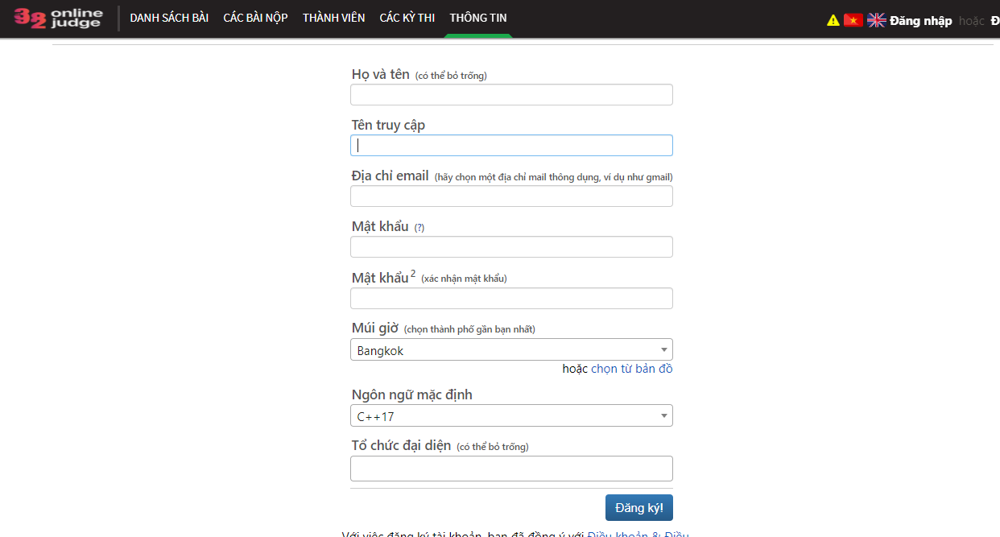
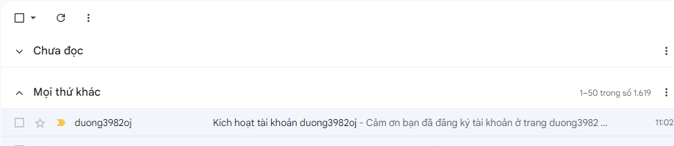

# Hệ thống chấm bài tự động Duong3982oj

Bạn cần đăng ký tài khoản trên hệ thống chấm bài tự động để nộp bài tập và xem kết quả chấm bài.

## Đăng ký tài khoản

Truy cập trang web: http://oj.duong3982.com/accounts/register/

- Phần **Họ và tên** là họ và tên của bạn, Ví dụ "Nguyễn Văn A"
- Phần **Tên truy cập** là tên đăng nhập của bạn, viết bằng chữ thường không dấu, không chứa khoảng trắng, không chứa ký tự đặc biệt. Ví dụ: `NguyenVanA` hoặc `nguyenvana` hoặc `nguyenvan_a` hoặc `nguyenvan_a123`.
- Phần **Email** là email của bạn
- Phần **Mật khẩu** là mật khẩu của bạn
- Phần **Nhập lại mật khẩu** là nhập lại mật khẩu của bạn.
- Phần **Múi giờ** chọn là saigon
- Phần **Ngôn ngữ mặc định** chọn là **C++ 20**

Chọn **Đăng ký** để đăng ký tài khoản.

Sau khi đăng ký thành công, bạn sẽ nhận được email xác nhận đăng ký. Bạn cần xác nhận email để kích hoạt tài khoản.

Truy cập email của bạn, mở email từ hệ thống và chọn **Xác nhận tài khoản** để kích hoạt tài khoản.

Bấm vào đường link để kích hoạt tài khoản theo hướng dẫn của email.

Cuối cùng, truy cập trang web: http://oj.duong3982.com/accounts/login/?next= 
để đăng nhập vào hệ thống.