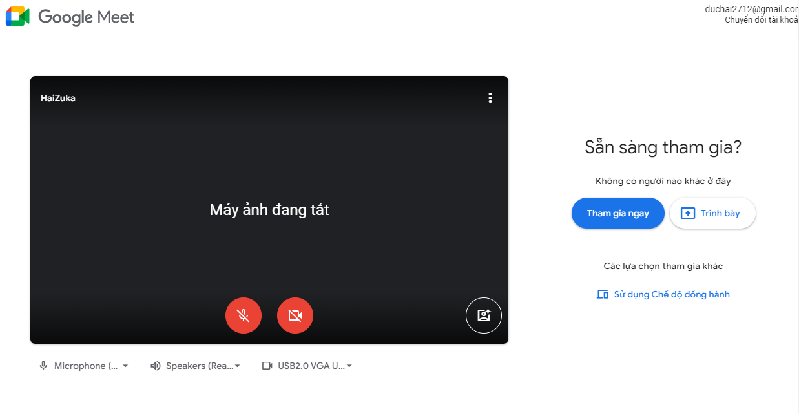
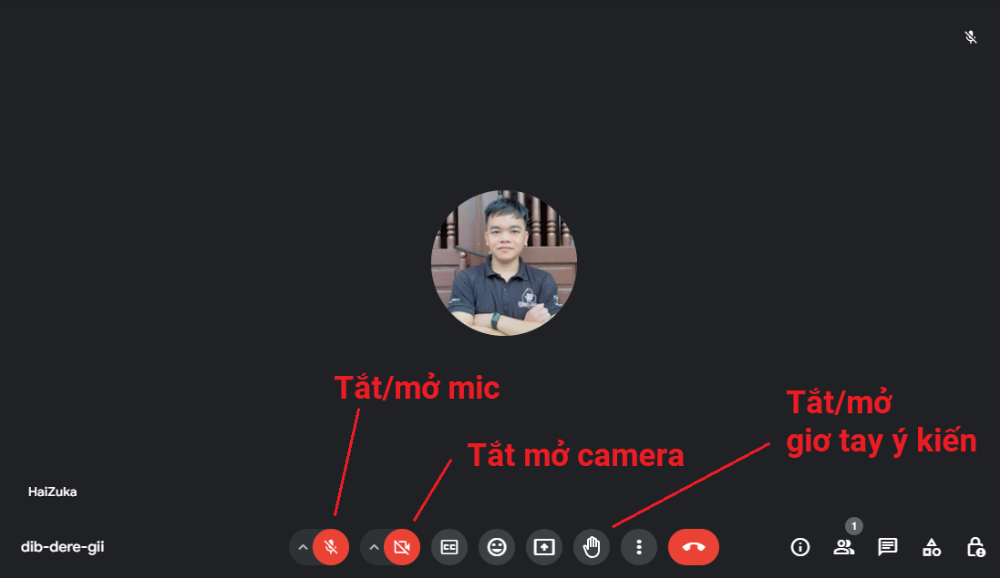
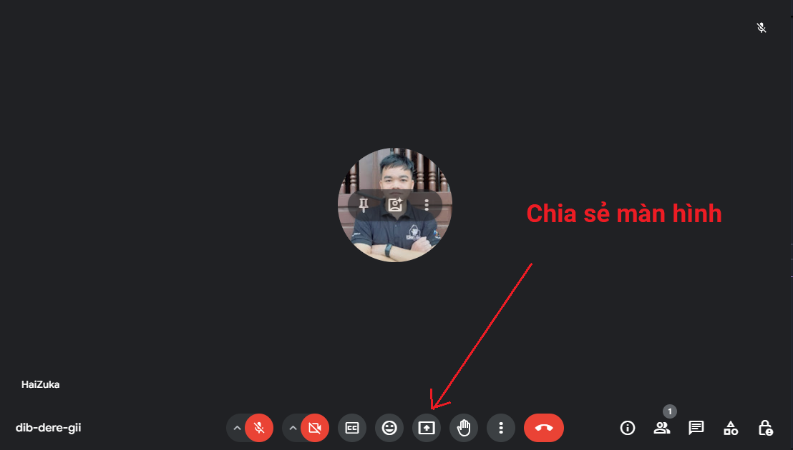
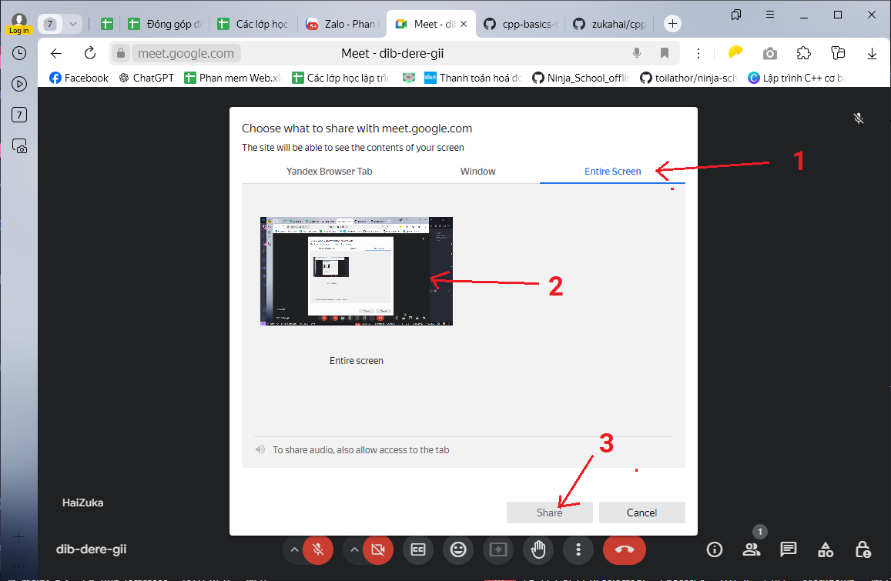
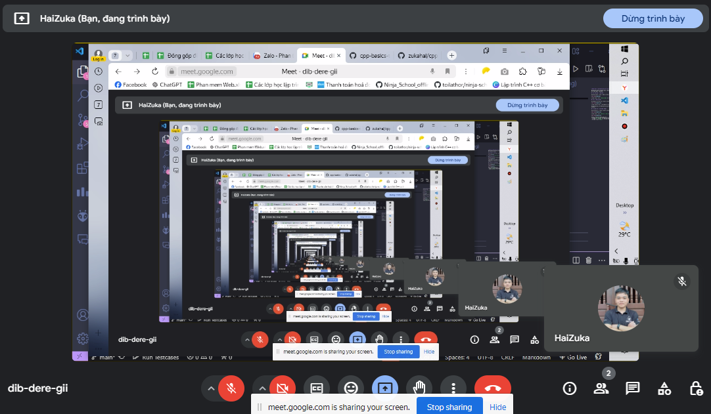

# Hướng dẫn sửa dụng gg meet để học online

Mỗi buổi học mình sẽ cung cấp cho các bạn một link để truy cập gg meet. Các bạn click vào link đó để tham gia vào buổi học.

## Cách tham gia vào buổi học

Saun khi click vào link, các bạn sẽ thấy một trang như sau:

Các bạn click vào nút `Tham gia ngay` để tham gia vào buổi học.

## Cách sử dụng gg meet

Khi tham gia vào buổi học, các bạn sẽ thấy một giao diện như sau:

Các bạn nên tắt tiếng và tắt camera để tránh gây nhiễu cho người khác.

Khi muốn hỏi bài, các bạn click vào biểu tượng `Raise hand` (biểu tượng tay giơ lên) để cho mình biết

## Các chia sẻ màn hình (Quan trọng)

Khi mình chia sẻ màn hình, các bạn sẽ thấy màn hình của mình như sau:

Các bạn click vào nút `Chia sẻ màn hình` để chia sẻ màn hình của mình.

Sau đó, các bạn thực hiện 3 bước sau:
- 1: Chọn `entire screen` để chia sẻ toàn bộ màn hình.
- 2: Chọn vào màn hình mà các bạn muốn chia sẻ.
- 3: Click vào nút `Share`.

Sau khi chia sẻ màn hình, các bạn sẽ thấy màn hình của mình được chia sẻ như sau:

Để tắt chia sẻ màn hình, các bạn click vào nút `Stop presenting`. (Dừng trình bày)