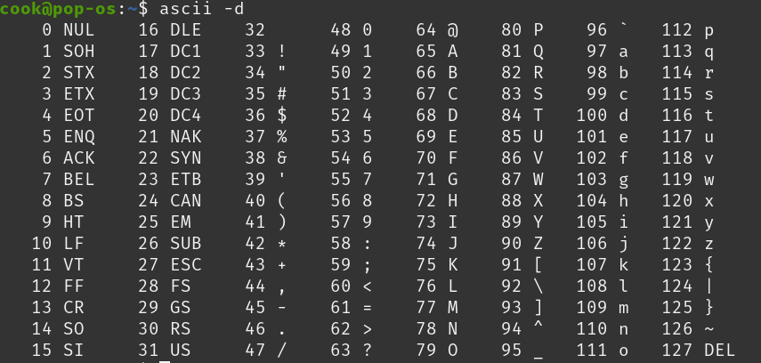

# Ký tự và chuỗi

  

## Bài 1: Ký tự và ví trí ký tự

Nhập vào một ký tự và in ra ký tự đó và vị trí của ký tự đó trong bảng mã ASCII.

**Input:**

- Một ký tự `c`

**Output:**

- Dòng đầu tiên in ra ký tự `c`
- Dòng thứ hai in ra vị trí của ký tự `c` trong bảng mã ASCII.

### Ví dụ

#### Ví dụ 1:

| Input | Output |
|-------|--------|
| A     | A  65 |

#### Ví dụ 2:

| Input | Output |
|-------|--------|
| a     | a  97 |

#### Ví dụ 3:

| Input | Output |
|-------|--------|
| =     | =  61 |

## Bài 2: Kiểm tra ký tự

Nhập và một ký tự `c`

- In ra 1 nếu ký tự `c` là chữ cái in hoa.
- In ra 2 nếu ký tự `c` là chữ cái in thường.
- In ra 3 nếu ký tự `c` là chữ số.
- In ra 4 nếu ký tự `c` là ký tự đặc biệt.

**Input:**

- Một ký tự `c`

**Output:**

- In ra 1 nếu ký tự `c` là chữ cái in hoa.

- In ra 2 nếu ký tự `c` là chữ cái in thường.

- In ra 3 nếu ký tự `c` là chữ số.

- In ra 4 nếu ký tự `c` là ký tự đặc biệt.

### Ví dụ

#### Ví dụ 1:

| Input | Output |
|-------|--------|
| A     | 1      |

#### Ví dụ 2:

| Input | Output |
|-------|--------|
| n     | 2      |

#### Ví dụ 3:

| Input | Output |
|-------|--------|
| 5     | 3      |

#### Ví dụ 4:

| Input | Output |
|-------|--------|
| @     | 4      |

## Bài 3: Ký tự trước và ký tự sau

Nhập vào một ký tự `c` (c chữ từ 'b' đến 'y'). 
Hãy in ra ký tự trước và ký tự sau ký tự `c` trong bảng chữ cái.

**Input:**

- Một ký tự `c` (c chữ cái từ 'b' đến 'y')

**Output:**

- Dòng đầu tiên in ra ký tự trước ký tự `c` trong bảng chữ cái.

- Dòng thứ hai in ra ký tự sau ký tự `c` trong bảng chữ cái.

### Ví dụ

#### Ví dụ 1:

| Input | Output |
|-------|--------|
| c     | b  d  |

#### Ví dụ 2:

| Input | Output |
|-------|--------|
| m     | l  n  |

#### Ví dụ 3:

| Input | Output |
|-------|--------|
| y     | x  z  |

## Bài 4: In hoa chữ cái

Nhập vào một ký tự `c` (c chữ cái từ 'a' đến 'z'). 

Hãy in ra ký tự `c` ở dạng in hoa.

**Input:**

- Một ký tự `c` (c chữ cái từ 'a' đến 'z')

**Output:**

- In ra ký tự `c` ở dạng in hoa.

### Ví dụ

#### Ví dụ 1:

| Input | Output |
|-------|--------|
| a     | A      |

#### Ví dụ 2:

| Input | Output |
|-------|--------|
| b     | B      |

#### Ví dụ 3:

| Input | Output |
|-------|--------|
| z     | Z      |

## Bài 5: Chuỗi đảo ngược

Nhập vào một chuỗi ký tự `s` (độ dài chuỗi `s` không quá 100). 

Hãy in ra chuỗi s và chuỗi đảo ngược của chuỗi `s`.

**Input:**

- Một chuỗi ký tự `s` (độ dài chuỗi `s` không quá 100)

**Output:**

- Dòng đầu tiên in ra chuỗi `s`.

- Dòng thứ hai in ra chuỗi đảo ngược của chuỗi `s`.

### Ví dụ

#### Ví dụ 1:

| Input | Output |
|-------|--------|
| abc   | abc  cba  |

#### Ví dụ 2:

| Input | Output |
|-------|--------|
| hello | hello  olleh |

#### Ví dụ 3:

| Input | Output |
|-------|--------|
| xin chao | xin chao  oahc nix  |

## Bài 6: Tổng các ký tự số

Nhập vào một chuỗi ký tự `s` (độ dài chuỗi `s` không quá 100). 

Hãy tính tổng các ký tự số trong chuỗi `s`.

**Input:**

- Một chuỗi ký tự `s` (độ dài chuỗi `s` không quá 100)

**Output:**

- In ra tổng các ký tự số trong chuỗi `s`.

### Ví dụ

#### Ví dụ 1:

| Input | Output |
|-------|--------|
| abc123   | 6  |

#### Ví dụ 2:

| Input | Output |
|-------|--------|
| 12ksv9 | 12  |

#### Ví dụ 3:

| Input | Output |
|-------|--------|
| abc | 0  |

## Bài 7: Chuỗi in thường và chuỗi in hoa

Nhập vào một chuỗi ký tự `s` (độ dài chuỗi `s` không quá 100). 

Hãy in ra chuỗi `s` ở dạng in thường và chuỗi `s` ở dạng in hoa.

**Input:**

- Một chuỗi ký tự `s` (độ dài chuỗi `s` không quá 100)

**Output:**

- Dòng đầu tiên in ra chuỗi `s` ở dạng in thường.

- Dòng thứ hai in ra chuỗi `s` ở dạng in hoa.

### Ví dụ

#### Ví dụ 1:

| Input | Output |
|-------|--------|
| abc   | abc  ABC  |

#### Ví dụ 2:

| Input | Output |
|-------|--------|
| Hello | hello  HELLO |

#### Ví dụ 3:

| Input | Output |
|-------|--------|
| Xin Chao | xin chao  XIN CHAO  |

## Bài 8: Các từ trong chuỗi

Nhập vào một chuỗi ký tự `s` (độ dài chuỗi `s` không quá 100). 
Các từ trong chuỗi `s` được phân cách bởi dấu cách. 

Hãy in ra các từ trong chuỗi `s`. Mỗi từ trên một dòng.

**Input:**

- Một chuỗi ký tự `s` (độ dài chuỗi `s` không quá 100)

**Output:**

- In ra các từ trong chuỗi `s`.

### Ví dụ

#### Ví dụ 1:

| Input | Output |
|-------|--------|
| Hello World   | Hello  World  |

#### Ví dụ 2:

| Input | Output |
|-------|--------|
| Xin Chao | Xin  Chao  |

#### Ví dụ 3:

| Input | Output |
|-------|--------|
|Khoa hoc lap trinh C++ | Khoa  hoc  lap  trinh  C++  |

## Bài 9: Kiểm tra chuỗi đối xứng

Nhập vào một chuỗi ký tự `s` (độ dài chuỗi `s` không quá 100). 

Hãy kiểm tra xem chuỗi `s` có phải là chuỗi đối xứng hay không.

Chuỗi đối xứng là chuỗi mà khi đọc từ trái sang phải hoặc từ phải sang trái đều giống nhau.

**Input:**

- Một chuỗi ký tự `s` (độ dài chuỗi `s` không quá 100)

**Output:**

- In ra `YES` nếu chuỗi `s` là chuỗi đối xứng.

- In ra `NO` nếu chuỗi `s` không phải là chuỗi đối xứng.

### Ví dụ

#### Ví dụ 1:

| Input | Output |
|-------|--------|
| abcba   | YES  |

#### Ví dụ 2:

| Input | Output |
|-------|--------|
| abccba | YES  |

#### Ví dụ 3:

| Input | Output |
|-------|--------|
| abc | NO  |

## Bài 10: In ra từ dài nhất

Nhập vào một chuỗi ký tự `s` (độ dài chuỗi `s` không quá 100). 

Hãy in ra từ dài nhất trong chuỗi `s`. Nếu có nhiều từ cùng độ dài nhất thì in ra từ đầu tiên.

**Input:**

- Một chuỗi ký tự `s` (độ dài chuỗi `s` không quá 100)

**Output:**

- In ra từ dài nhất trong chuỗi `s`.

### Ví dụ

#### Ví dụ 1:

| Input | Output |
|-------|--------|
| Xin chao  |  chao  |

#### Ví dụ 2:

| Input | Output |
|-------|----------|
| Khoa hoc lap trinh |  trinh  |

#### Ví dụ 3:

| Input | Output |
|-------|--------|
| abc | abc  |

