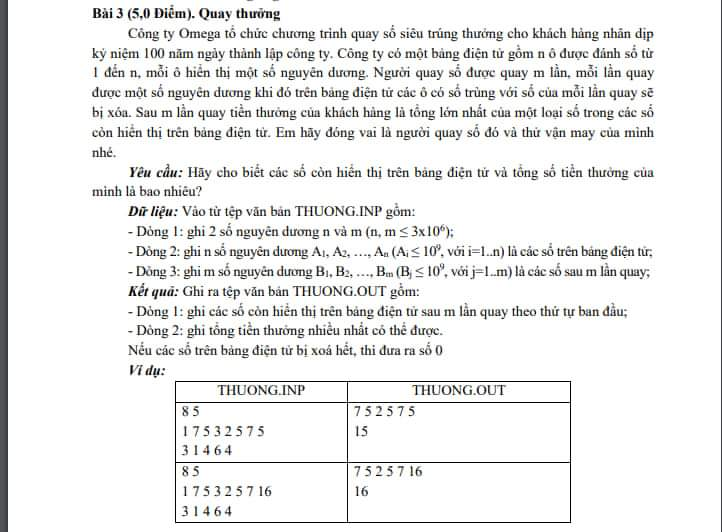

## Bài 1: Số xuất hiện nhiều nhất trong dãy

Cho một dãy số nguyên, bạn hãy viết chương trình để tìm ra số xuất hiện nhiều nhất trong dãy số đó. Nếu có nhiều số xuất hiện cùng số lần thì chọn số nhỏ nhất.

**Đầu vào**:

- Dòng đầu tiên chứa một số nguyên n (1 ≤ n ≤ 105)  - số lượng phần tử của dãy số.
- Dòng thứ hai chứa n số nguyên a1, a2, ..., an (-1018 ≤ ai ≤ 1018) - dãy số nguyên.

**Đầu ra**:

- In ra số nguyên xuất hiện nhiều nhất trong dãy số.

**Ví dụ**:

**Ví dụ 1**

| Input | Output |
|-------|--------|
| 6   1 2 2 1 1 6 | 1 |

**Ví dụ 2**

| Input | Output |
|-------|--------|
| 5   1 3 2 2 3 | 2 | 

## Bài 2: Từ xuất hiện nhiều nhất trong câu

Cho một câu, bạn hãy viết chương trình để tìm ra từ xuất hiện nhiều nhất trong câu. Nếu có nhiều từ xuất hiện cùng số lần thì chọn từ nhỏ nhất.

**Đầu vào**:

- Dòng đầu tiên chứa một chuỗi s (1 ≤ |s| ≤ 105) - câu.

**Đầu ra**:

- In ra từ xuất hiện nhiều nhất trong câu.

**Ví dụ**:

**Ví dụ 1**

| Input | Output |
|-------|--------|
| hello world hello | hello |

**Ví dụ 2**

| Input | Output |
|-------|--------|
| hello world hello world | hello |

**Ví dụ 3**

| Input | Output |
|-------|--------|
| hello world hello world world | world |

# Bài 3: Danh sách học sinh

Trường học VKU có 2 đội tuyển học sinh giỏi tin và giỏi toán. Đội tuyển tin có n học sinh, đội tuyển toán có m học sinh. Mỗi học sinh sẽ mang một giá trị là mã sinh viên.

Hãy tìm ra các học sinh vừa nằm trong đội tuyển tin vừa nằm trong đội tuyển toán.

**Đầu vào**

- Dòng đầu tiên chứa 2 số nguyên n, m (1 ≤ n, m ≤ 105)

- Dòng thứ hai chứa n số nguyên a1, a2, ..., an (0 ≤ ai ≤ 1018) - mã sinh viên của học sinh đội tuyển tin

- Dòng thứ ba chứa m số nguyên b1, b2, ..., bm (0 ≤ bi ≤ 1018) - mã sinh viên của học sinh đội tuyển toán

**Đầu ra**

- In ra màn hình các mã sinh viên của học sinh vừa nằm trong đội tuyển tin vừa nằm trong đội tuyển toán. Nếu không có học sinh nào thì in ra "-1".

## Ví dụ 1

| Input | Output |
|-------|--------|
| 5 5  1 2 3 4 5  3 4 5 6 7 | 3 4 5 |

## Ví dụ 2

| Input | Output |
|-------|--------|
| 5 4  1 2 3 4 5  4 7 8 9 | 4 |

## Ví dụ 3

| Input | Output |
|-------|--------|
| 5 5  1 2 3 4 5  6 7 8 9 10 | -1 |

## Bài 4: Quay thưởng

    

