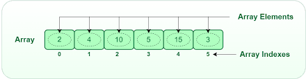

# Mảng trong C++

## 1. Khái niệm

Mảng là một tập hợp các phần tử có cùng kiểu dữ liệu và được lưu trữ liên tiếp trong bộ nhớ. Mỗi phần tử trong mảng được xác định bằng chỉ số của nó. Chỉ số của mảng bắt đầu từ 0.

<p align="center">  </p>

## 2. Khai báo mảng

Cú pháp khai báo mảng trong C++:

```cpp

    <kiểu dữ liệu> <tên mảng>[<số phần tử>];

```

Ví dụ:

```cpp

    int arr[5];

```

Lúc này, mảng `arr` có 5 phần tử kiểu `int`. Mỗi phần tử trong mảng `arr` có thể truy cập thông qua chỉ số của nó.

## 3. Truy cập phần tử trong mảng

Để truy cập phần tử trong mảng, ta sử dụng chỉ số của phần tử đó. Chỉ số của mảng bắt đầu từ 0.

Ví dụ:

```cpp

    int arr[5] = {1, 2, 3, 4, 5};

    cout << arr[0]; // In ra 1
    cout << arr[1]; // In ra 2
    cout << arr[2]; // In ra 3
    cout << arr[3]; // In ra 4
    cout << arr[4]; // In ra 5

```

Mỗi phần tử trong mảng có thể sư dụng như một biến thông thường.

## 4. Gán giá trị cho phần tử trong mảng

Để gán giá trị cho phần tử trong mảng, ta sử dụng chỉ số của phần tử đó.


Ví dụ:

```cpp

    int arr[5];

    arr[0] = 1;
    arr[1] = 2;
    arr[2] = 3;
    arr[3] = 4;
    arr[4] = 5;

```

## Bài tập

### Bài 1 Nhập xuất mảng

Viết chương trình nhập vào một số nguyên `n` và một mảng `a` gồm `n` phần tử. In ra màn hình mảng `a` vừa nhập.

Ví dụ:

- Input (đầu vào):


```
5
1 2 3 4 5
```

- Output (đầu ra):

```
1 2 3 4 5
```

Bài là của Quyết:

```cpp
#include <iostream>

using namespace std;

int main() {
    int n;
    int a[1000];
    cin >> n;
    for (int i = 0; i < n; i++)
        cin >> a[i];
    for (int i = 0; i < n; i++)
        cout << a[i] << " ";
    
}
```

### Bài 2. In mảng ngược

Viết chương trình nhập vào một số nguyên `n` và một mảng `a` gồm `n` phần tử. In ra màn hình mảng `a` theo thứ tự ngược lại.

Ví dụ:

- Input (đầu vào):

```
5
1 2 3 4 5
```

- Output (đầu ra):

```
5 4 3 2 1
```

Bài làm của Quyết:

```cpp
#include <iostream>

using namespace std;

int main() {
    int n;
    int a[1000];
    cin >> n;
    for (int i = 0; i < n; i++)
        cin >> a[i];
    for (int i = n - 1; i >= 0; i--)
        cout << a[i] << " ";
    
}

// 0 1 2 3 ... n - 1
```

### Bài 3. Phần tử đầu tiên và cuối cùng

Viết chương trình nhập vào một số nguyên `n` và một mảng `a` gồm `n` phần tử. In ra màn hình phần tử đầu tiên và phần tử cuối cùng trong mảng `a`.

Ví dụ:

- Input (đầu vào):

```
5
1 2 3 4 5
```

- Output (đầu ra):

```
1 5
```

Bài làm của Quyết:

```cpp
#include <iostream>

using namespace std;

int main() {
    int n;
    int a[1000];
    cin >> n;
    for (int i = 0; i < n; i++)
        cin >> a[i];
    cout << a[0] << " " << a[n - 1];
    
}
// 0 1 2 3 ... n - 1
```

### Bài 4. Tính tổng các phần tử trong mảng

Viết chương trình nhập vào một số nguyên `n` và một mảng `a` gồm `n` phần tử. Tính tổng các phần tử trong mảng `a` và in ra màn hình.

Ví dụ:

- Input (đầu vào):

```
4
2 3 4 1
```

- Output (đầu ra):

```
10
```

Bài làm của Quyết:

```cpp
#include <iostream>

using namespace std;

int main() {
    int n;
    int a[1000];
    int tong = 0;
    cin >> n;
    for (int i = 0; i < n; i++)
        cin >> a[i];
    for (int i = 0; i < n; i++)
        tong += a[i];
    cout << tong;
        
}
// i: Chỉ số, ví trí
// a[i]: phần tử, giá trị tại chỉ số i
```

### Bài 5. Phần tử chẵn

Viết chương trình nhập vào một số nguyên `n` và một mảng `a` gồm `n` phần tử. In ra màn hình các phần tử chẵn trong mảng `a`. Đầu vào đảm bảo mảng `a` có ít nhất một phần tử chẵn.

Ví dụ:

- Input (đầu vào):

```
5
1 2 3 4 5
```

- Output (đầu ra):

```
2 4
```

Bài làm của Quyết:

```cpp
#include <iostream>

using namespace std;

int main() {
    int n;
    int a[1000];
    cin >> n;
    for (int i = 0; i < n; i++)
        cin >> a[i];
    for (int i = 0; i < n; i++)
        if (a[i] % 2 ==0)
        {
            cout << a[i] << " ";
        }
        
}
// i: Chỉ số, ví trí
// a[i]: phần tử, giá trị tại chỉ số i
```

### Bài 6. Phần tử chẵn đầu tiên

Viết chương trình nhập vào một số nguyên `n` và một mảng `a` gồm `n` phần tử. In ra màn hình phần tử chẵn đầu tiên trong mảng `a`. Đầu vào đảm bảo mảng `a` có ít nhất một phần tử chẵn.

Ví dụ:

- Input (đầu vào):

```
5
1 3 5 2 4
```

- Output (đầu ra):

```
2
```

Bài làm của Quyết:

```cpp
#include <iostream>

using namespace std;

int main() {
    int n;
    int a[1000];
    cin >> n;
    for (int i = 0; i < n; i++)
        cin >> a[i];
    for (int i = 0; i < n; i++)
        if (a[i] % 2 ==0)
        {
            cout << a[i] << " ";
            break;
        }
        
}
// i: Chỉ số, ví trí
// a[i]: phần tử, giá trị tại chỉ số i
```

### Bài 7. Phần tử chẵn cuối cùng

Viết chương trình nhập vào một số nguyên `n` và một mảng `a` gồm `n` phần tử. In ra màn hình phần tử chẵn cuối cùng trong mảng `a`. Đầu vào đảm bảo mảng `a` có ít nhất một phần tử chẵn.

Ví dụ:

- Input (đầu vào):

```
5
1 3 5 2 4
```

- Output (đầu ra):

```
4
```

Bài làm của Quyết:

```cpp
#include <iostream>

using namespace std;

int main() {
    int n;
    int a[1000];
    cin >> n;
    for (int i = 0; i < n; i++)
        cin >> a[i];
    for (int i = n - 1; i >= 0; i--)
        if (a[i] % 2 ==0)
        {
            cout << a[i] << " ";
            break;
        }
        
}
// i: Chỉ số, ví trí
// a[i]: phần tử, giá trị tại chỉ số i
```

### Bài 8. Phần tử lớn nhất

Viết chương trình nhập vào một số nguyên `n` và một mảng `a` gồm `n` phần tử. In ra màn hình phần tử lớn nhất trong mảng `a`.

Ví dụ:

- Input (đầu vào):

```
5
1 3 5 2 4
```

- Output (đầu ra):

```
5
```

### Bài 9. Phần tử nhỏ nhất

Viết chương trình nhập vào một số nguyên `n` và một mảng `a` gồm `n` phần tử. In ra màn hình phần tử nhỏ nhất trong mảng `a`.

Ví dụ:

- Input (đầu vào):

```
5
1 3 5 2 4
```

- Output (đầu ra):

```
1
```


