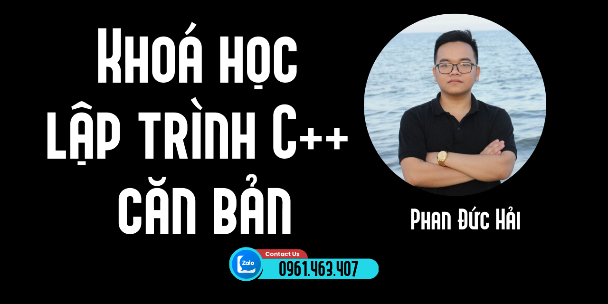

# Lộ trình học C++ cơ bản cho người mới bắt đầu

C++ là một ngôn ngữ lập trình mạnh mẽ và phổ biến. C++ được sử dụng rộng rãi trong phát triển phần mềm, game, hệ điều hành, trình duyệt

  

C++ có ứng dụng di động, ứng dụng web, ứng dụng máy học, ứng dụng AI, ứng dụng IoT, ứng dụng Blockchain, ứng dụng Big Data, ứng dụng Cloud, ứng dụng DevOps, ứng dụng Cyber Security, ứng dụng Robotics, ứng dụng Automation, ứng dụng Embedded, ứng dụng Desktop, ứng dụng Server, ứng dụng Database, ứng dụng Networking, ứng dụng Multimedia, ứng dụng Graphics, ứng dụng Game Engine, ứng dụng Virtual Reality, ứng dụng Augmented Reality, ứng dụng Mixed Reality, ứng dụng Quantum Computing, ứng dụng Cryptography, ứng dụng Machine Learning, ứng dụng Deep Learning, ứng dụng Reinforcement Learning, ứng dụng Computer Vision, ứng dụng Natural Language Processing, ứng dụng Speech Recognition, ứng dụng Text to Speech, ứng dụng Chatbot, ứng dụng Recommendation System, ứng dụng Search Engine, ứng dụng Web Scraper, ứng dụng Automation Testing, ứng dụng Performance Testing, ứng dụng Security Testing, ứng dụng Unit Testing, ứng dụng Integration Testing, ứng dụng System Testing, ứng dụng End-to-End Testing, ứng dụng Regression Testing, ứng dụng Smoke Testing, ứng dụng Sanity Testing, ứng dụng Acceptance Testing, ứng dụng Alpha Testing,

Dưới đây là lộ trình học C++ cơ bản cho người mới bắt đầu. Lộ trình này sẽ giúp các em nắm vững kiến thức cơ bản về ngôn ngữ lập trình C++.

- Cấu trúc chương trình C++
- Các sử dụng cout
- Các kiểu dữ liệu trong C++
- Các toán tử trong C++
- Cách sử dụng cin
- Câu lệnh điều kiện if
- Câu lệnh điều kiện if else
- Câu lệnh điều kiện switch case
- Vòng lặp for
- Vòng lặp while
- Vòng lặp do while
- Mảng trong C++
- Chuỗi trong C++
- Hàm trong C++ 