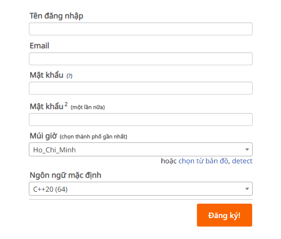

# Tham gia tleoj

Trong quá trình học tập, việc tham gia các cuộc thi, sự kiện là một cách tốt để rèn luyện kỹ năng lập trình, giải quyết vấn đề và tìm hiểu thêm về ngôn ngữ lập trình, thuật toán, cấu trúc dữ liệu, ...

Trong bài viết này, mình sẽ hướng dẫn các bạn cách tham gia cuộc thi trên trang web [https://tleoj.edu.vn/](https://tleoj.edu.vn/).

## Đăng ký tài khoản

Đầu tiên, các bạn truy cập vào trang web [https://tleoj.edu.vn/](https://tleoj.edu.vn/), sau đó chọn `Đăng ký` để tạo tài khoản mới.

Điền đầy đủ thông tin vào form đăng ký, phần `ngôn ngữ mặc định` hay chọn **C++**, cuối cùng chọn `Đăng ký`, kiểm tra email và xác nhận đăng ký tài khoản.

## Tham gia khoá học

Sau khi đăng ký tài khoản, em truy cập vào trang web https://tleoj.edu.vn/organization/55-haizuka để tham gia khoá học.

